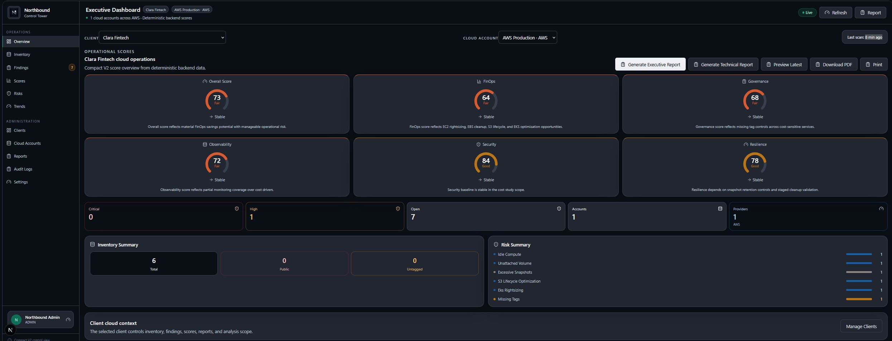
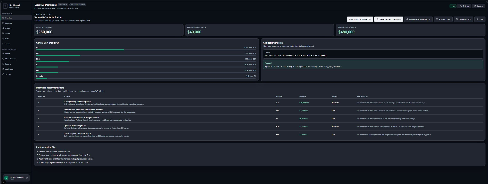
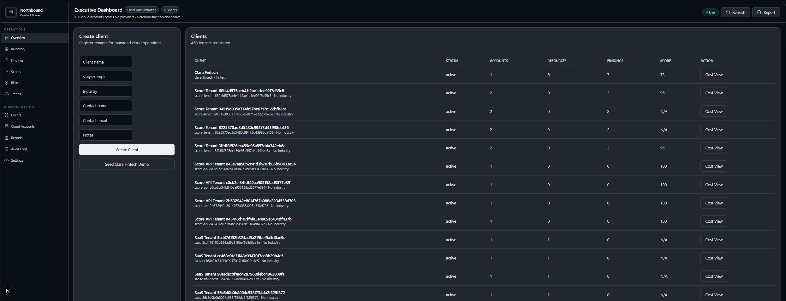
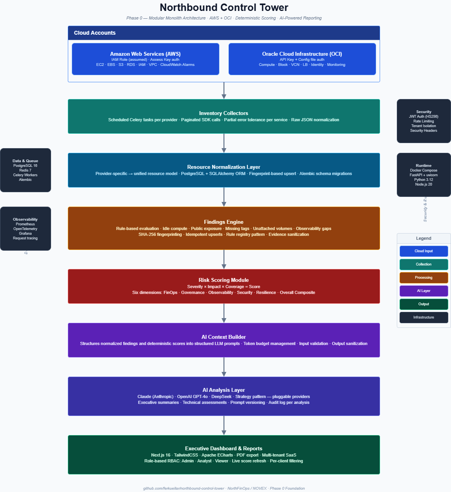

<div align="center">


<br/>
<br/>

# Northbound Control Tower

**Multicloud operational intelligence for teams that need visibility, not complexity.**

[](#roadmap)
[](#tech-stack)
[](#supported-clouds)
[](./LICENSE)
[](#roadmap)

</div>

---

## What is Northbound Control Tower?

Northbound Control Tower is an enterprise-oriented multicloud operational intelligence platform.
It gives cloud teams and executives a single, structured view of their cloud estate — covering inventory, cost exposure, governance gaps, observability readiness, and resilience posture — without requiring deep expertise in each provider's native tooling.

The platform ingests raw cloud data, normalizes it across providers, runs a findings engine against it, scores risk, and feeds the results into an AI-assisted reporting layer that produces both technical assessments and executive-ready summaries.

**The core problem it solves:**
Most organizations operating across AWS and OCI have fragmented visibility. Native consoles are siloed. Cost anomalies go undetected. Governance failures surface late. Executive reporting is manual. Control Tower closes those gaps in a single operational layer.

---

## Platform

### Executive Dashboard

Real-time operational scores across six dimensions with per-client filtering, inventory summary, and risk breakdown. All scores are deterministic and derived from live cloud inventory data.



> **Clara Fintech · AWS Production** — Overall score 73 · 7 open findings · 6 resources inventoried · AI-generated executive and technical reports available in one click.

---

### FinOps Cost Analysis

Deep cost exposure analysis with prioritized recommendations, estimated monthly savings, and downloadable cost model CSV.



> **$250,000/mo current spend · $40,000/mo in identified savings · $480,000/yr annualized**

---

### Multi-Tenant Client Management

Full multi-tenant architecture with per-client cloud account isolation, scoring, and portfolio-level administration.



> **450 tenants registered** — per-client score, account count, resource count, and finding count at a glance.

---

## What This Is Not (Phase 0 Scope)

Phase 0 establishes a deliberate, production-grade foundation. The following are **out of scope by design** and will be addressed in subsequent phases:

| Out of Scope — Phase 0 | Rationale |
|---|---|
| Kubernetes-native deployment | Operational complexity deferred |
| Microservices / event-driven architecture | Modular monolith first; split when justified |
| Event buses (Kafka, SQS) | Not required at current data volume |
| Auto-remediation | Trust must be established before automation acts |
| Real-time streaming | Near-realtime via scheduled polling is sufficient |
| Advanced RBAC / multi-tenant auth | Single-tenant API key auth in Phase 0 |
| Azure, GCP, or other clouds | AWS + OCI only until core model is stable |
| Billing ingestion at line-item level | Aggregate FinOps diagnostics only |

---

## Key Capabilities

### ☁️ Cloud Inventory
Collects, normalizes, and stores resource data from AWS and OCI into a unified schema. Compute, storage, networking, and IAM resources are catalogued continuously via scheduled collectors.

### 💰 FinOps Diagnostics
Identifies cost exposure signals: idle compute instances, unattached volumes, oversized resources, and resources missing budget-alignment tags. Findings are scored and surfaced with remediation context.

### 🔒 Governance Analysis
Evaluates cloud resources against governance baselines: missing required tags, publicly exposed assets, lack of encryption at rest or in transit, and deviation from resource naming conventions.

### 👁️ Observability Readiness
Assesses whether cloud resources have logging, metrics, and alerting configured. Produces a readiness score per account that maps directly to operational risk.

### 🛡️ HA/DR Readiness
Flags single points of failure: single-AZ deployments, missing backup configurations, absent cross-region replication, and non-redundant load balancer setups.

### 🤖 AI-Powered Reporting
Feeds normalized findings and risk scores into a structured AI context layer. Produces two output types:

- **Technical Assessment** — detailed findings with remediation steps, severity, and affected resources.
- **Executive Summary** — plain-language narrative for C-level and board-level audiences, with risk posture, cost exposure, and prioritized action items.

---

## Architecture



The pipeline flows from cloud account credentials through collection, normalization, and rule-based analysis into a deterministic scoring layer. Structured findings then feed an AI context builder that drives Claude, OpenAI, or DeepSeek to generate executive and technical reports surfaced in the Next.js dashboard.

For a full breakdown of each component, data models, and design decisions, see [ARCHITECTURE.md](./ARCHITECTURE.md).

---

## Tech Stack

| Layer | Technology | Role |
|---|---|---|
| **API** | FastAPI | REST API, async endpoints, OpenAPI schema |
| **Task Queue** | Celery + Redis | Scheduled collectors, async report generation |
| **Database** | PostgreSQL + SQLAlchemy | Primary data store, ORM |
| **Migrations** | Alembic | Schema versioning and migration management |
| **Cache / Broker** | Redis | Celery broker, result backend, short-lived cache |
| **Frontend** | Next.js + TailwindCSS | Dashboard UI, report viewer |
| **Charts** | Apache ECharts | Resource distribution, risk trends, cost signals |
| **AI Layer** | Anthropic Claude / OpenAI / DeepSeek | Executive summaries, technical assessments |
| **Metrics** | Prometheus | Collector metrics, task duration, finding counts |
| **Tracing** | OpenTelemetry | Distributed tracing, instrumentation hooks |
| **Dashboards** | Grafana | Operational observability for the platform itself |
| **Infrastructure** | Docker Compose | Local and staging environments |

---

## Supported Clouds

| Provider | Status | Credential Method |
|---|---|---|
| AWS | ✅ Phase 0 | IAM Role (assumed) or Access Key |
| OCI | ✅ Phase 0 | API Key + config file |
| Azure | 🔜 Phase 1 | — |
| GCP | 🔜 Phase 2 | — |

---

## Getting Started

**Prerequisites:** Docker, Docker Compose, Git

```bash
# 1. Clone
git clone https://github.com/ferkuellar/northbound-control-tower.git
cd northbound-control-tower

# 2. Configure environment
make setup       # copies .env.example → .env
# Edit .env: set JWT_SECRET_KEY and optionally ANTHROPIC_API_KEY

# 3. Start the platform
make up

# 4. Open the dashboard
open http://localhost:3000
```

**Services after `make up`:**

| Service | URL | Description |
|---|---|---|
| Frontend | http://localhost:3000 | Executive Dashboard |
| Backend API | http://localhost:8000 | FastAPI — OpenAPI docs at `/docs` |
| Prometheus | http://localhost:9090 | Metrics |
| Grafana | http://localhost:3001 | Platform observability (admin / admin) |

**Common commands:**

```bash
make logs           # Stream all service logs
make backend-test   # Run pytest suite
make backend-lint   # Ruff check
make frontend-lint  # ESLint
make down           # Stop all services
make clean          # Stop + remove volumes
```

---

## Documentation

| Document | Purpose | Audience |
|---|---|---|
| **README** *(this file)* | Platform overview, capabilities, architecture | All |
| [ARCHITECTURE.md](./ARCHITECTURE.md) | Component design, data model, technical decisions | Engineers, Architects |
| [QUICKSTART.md](./QUICKSTART.md) | Run the stack locally in under 30 minutes | Engineers |
| [API_REFERENCE.md](./API_REFERENCE.md) | Full endpoint reference, request/response schemas | Developers, Integrators |
| [CONTRIBUTING.md](./CONTRIBUTING.md) | Branch conventions, how to add collectors and findings | Contributors |

---

## Roadmap

Control Tower is developed in phases. Each phase delivers a stable, production-usable increment before extending scope.

| Phase | Focus | Status |
|---|---|---|
| **Phase 0** | Modular monolith — AWS + OCI, core findings, AI reports, multi-tenant SaaS | 🔵 Active |
| **Phase 1** | Azure support, advanced RBAC, multi-tenant accounts, billing ingestion | ⚪ Planned |
| **Phase 2** | GCP support, auto-remediation workflows, Slack/Teams alerting | ⚪ Planned |
| **Phase 3** | Kubernetes-native deployment, event-driven architecture, SaaS mode | ⚪ Planned |

Phase boundaries are intentional. New capabilities are added only after the current phase is stable and operationally validated.

---

## License

Proprietary. All rights reserved.
© Northbound — NorthFinOps / NOVEX

For licensing inquiries, contact the maintainers through the repository.

---

<div align="center">
<sub>Built with FastAPI · Next.js · PostgreSQL · Celery · Prometheus · OpenTelemetry · Claude AI</sub>
</div>